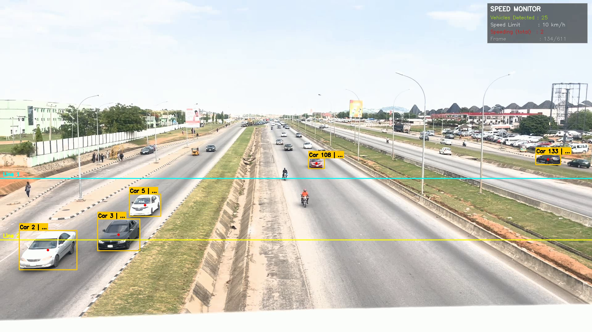
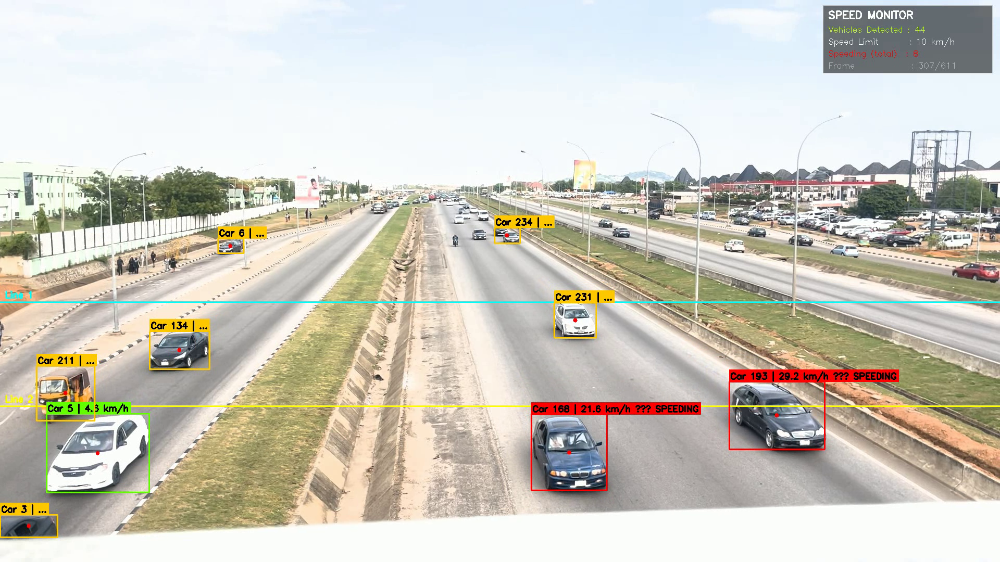
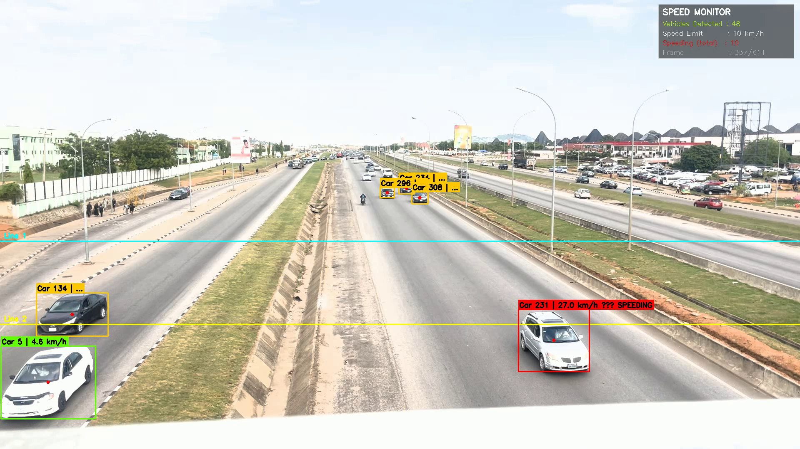

# Real-Time Vehicle Speed Detection with YOLOv8

> A computer vision system that detects, tracks, and measures the speed of vehicles
> in real traffic footage — built using YOLOv8, BoT-SORT tracking, and OpenCV.
> Tested on real highway footage from Abuja, Nigeria.

---

## 📸 Screenshots

<p align="center">
  
  <br><em>Task 1 & 2 — Vehicle detection and tracking with persistent IDs across frames</em>
</p>

<p align="center">
  
  <br><em>Task 3 — Speed measurement with live SPEED MONITOR dashboard and speeding alerts</em>
</p>

<p align="center">
  
  <br><em>Real-time red alert on speeding vehicles — 48 vehicles tracked simultaneously</em>
</p>

---

## Project Results

| Metric | Value |
|--------|-------|
| Model | YOLOv8n (nano) — pre-trained on COCO |
| Tracker | BoT-SORT |
| Vehicle classes | Car, Motorcycle, Bus, Truck |
| Max vehicles tracked simultaneously | 48 |
| Speed calculation method | Two-line time-distance method |
| Output | Annotated MP4 with live dashboard overlay |
| Platform | Google Colab |

---

## How It Works

The project is built in **3 progressive tasks**, each adding a new capability:

```
Task 1: Detection
  → YOLO identifies vehicles in each frame
  → Draws bounding boxes with class labels and confidence scores

Task 2: Tracking
  → BoT-SORT assigns a unique persistent ID to each vehicle
  → The same car keeps the same ID across all frames
  → Enables linking a vehicle's position across time

Task 3: Speed Measurement
  → Two horizontal reference lines are drawn across the road
  → When a vehicle's center crosses Line 1, the frame number is recorded
  → When it crosses Line 2, the frame number is recorded again
  → Speed = Distance ÷ Time (converted to km/h)
  → Vehicles above the speed limit are flagged RED with a SPEEDING alert
```

### Speed Formula

```
frames_elapsed  = line2_frame - line1_frame
time_elapsed    = frames_elapsed ÷ FPS
speed_ms        = real_world_distance_meters ÷ time_elapsed
speed_kmh       = speed_ms × 3.6
```

---

## Visual Features

| Feature | Description |
|---------|-------------|
| 🟡 Yellow-orange box | Vehicle detected, speed not yet measured |
| 🟢 Green box | Vehicle within speed limit |
| 🔴 Red box + SPEEDING alert | Vehicle exceeding speed limit |
| 🔵 Cyan line | Reference Line 1 |
| 🟡 Yellow line | Reference Line 2 |
| 🔴 Red dot | Center point of each tracked vehicle |
| Dashboard panel | Live count of vehicles, speed limit, speeding total, frame number |

---

## Project Structure

```
Vehicle-Speed-Detection/
│
├── Speed_Detection_updated.ipynb     ← Main notebook (3 tasks)
├── requirements.txt                  ← Python dependencies
├── README.md
│
├── assets/                           ← Screenshots and output previews
│   ├── screenshot_1_speeding_detected.png
│   ├── screenshot_2_speeding_alert.png
│   ├── screenshot_3_speed_tracking.png
│   └── screenshot_4_vehicle_detection.png
│
└── outputs/
    ├── task1_output.mp4              ← Detection only
    ├── task2_output.mp4              ← Detection + tracking
    └── task3_output.mp4              ← Detection + tracking + speed
```

---

## Quick Start

### 1. Clone the repository

```bash
git clone https://github.com/YOUR_USERNAME/Vehicle-Speed-Detection.git
cd Vehicle-Speed-Detection
```

### 2. Install dependencies

```bash
pip install -r requirements.txt
```

### 3. Run on your own video

```python
from ultralytics import YOLO
import cv2

# The model downloads automatically on first run
model = YOLO("yolov8n.pt")

# Change this to your video path
cap = cv2.VideoCapture("your_traffic_video.mp4")
```

### 4. Open in Google Colab

[](https://colab.research.google.com/github/YOUR_USERNAME/Vehicle-Speed-Detection/blob/main/Speed_Detection_updated.ipynb)

---

## Configuration

All key parameters are at the top of the Task 3 cell and easy to change:

```python
# ── Adjust these for your specific camera setup ──

LINE_1_Y        = 580    # Y-pixel position of reference Line 1
LINE_2_Y        = 780    # Y-pixel position of reference Line 2

PIXEL_TO_METER  = 0.05   # How many meters = 1 pixel (calibrate for your camera)
                          # Tip: place two objects 10m apart, count the pixels between them
                          # PIXEL_TO_METER = 10 ÷ pixel_count

FPS             = 30.0   # Frames per second of your input video

SPEED_LIMIT     = 10     # km/h — set low during development to verify alert logic
                          # Change to 80 or 120 for real highway deployment
```

### Understanding `PIXEL_TO_METER`

This value converts pixel distances in the video into real-world meters.
**It is not a universal constant** — it depends on your camera height, angle, and distance from the road.

For this project, `PIXEL_TO_METER = 0.05` was used as a working study value
to develop and verify the speed calculation logic end-to-end.
The formula and algorithm are correct — only this value needs measuring per deployment.

**How to calibrate it for a real camera:**
1. Pause your video on a clear frame
2. Find two points with a known real-world distance (e.g. lane markings are typically 6–10m apart)
3. Count the pixels between them using any image editor
4. Calculate: `PIXEL_TO_METER = real_distance_meters ÷ pixel_count`

Example: if two lane markings are 8m apart and 160 pixels apart in your video:
`PIXEL_TO_METER = 8 ÷ 160 = 0.05`

---

## Requirements

```
ultralytics>=8.0.0
opencv-python-headless>=4.8.0
```

Install:
```bash
pip install -r requirements.txt
```

---

## Technical Details

### Why YOLOv8?
YOLOv8 (You Only Look Once, version 8) processes the entire image in a single forward pass,
making it fast enough for real-time video processing. The nano variant (`yolov8n.pt`)
is used here for speed — it runs well even on Colab's free GPU tier.

### Why BoT-SORT?
Simple detection treats each frame independently — a car in frame 100 and frame 101
are strangers to the model. BoT-SORT assigns persistent IDs so we can track the same
vehicle across frames, which is essential for timing how long it takes to travel between lines.

### Why the two-line method?
Speed cameras and academic speed estimation systems commonly use virtual tripwires.
The method is robust because:
- It doesn't require camera calibration beyond the pixel-to-meter ratio
- It works at any camera angle as long as both lines are in view
- It's computationally lightweight — no optical flow or homography needed

### Vehicle classes (COCO IDs)
```python
VEHICLE_CLASSES = [2, 3, 5, 7]
# 2 = car
# 3 = motorcycle
# 5 = bus
# 7 = truck
```

---

## Known Limitations

| Limitation | Explanation |
|-----------|-------------|
| Speed accuracy depends on calibration | `PIXEL_TO_METER` must be measured for each camera setup |
| Perspective distortion | Vehicles far from the camera appear smaller — affects accuracy |
| Occlusion | When vehicles overlap, the tracker may swap IDs |
| Speed limit is configurable | Default `SPEED_LIMIT = 10` was used during development to verify alert triggering — set to your road's actual limit for deployment |
| Single camera view | Does not handle multiple camera angles |

---

## Roadmap & Improvements

- [ ] Calibrate `PIXEL_TO_METER` using lane marking measurements
- [ ] Set realistic speed limit (80 or 120 km/h for highway use)
- [ ] Add vehicle count log exported to CSV
- [ ] Add license plate region detection for violation logging
- [ ] Switch to `model.track()` with ByteTrack for smoother tracking
- [ ] Add perspective correction (homography transform) for better accuracy
- [ ] Deploy on Raspberry Pi or Jetson Nano with a live camera feed

---

## 📚 References

- [Ultralytics YOLOv8 Documentation](https://docs.ultralytics.com)
- [BoT-SORT: Robust Associations Multi-Pedestrian Tracking](https://arxiv.org/abs/2206.14651)
- [COCO Dataset — 80 Object Classes](https://cocodataset.org)
- [OpenCV VideoCapture Documentation](https://docs.opencv.org)

---

## Author

**Agu Jerry**
- LinkedIn: [your-linkedin](www.linkedin.com/in/jayy-agu)
- GitHub: [your-github](https://github.com/jayy-agu)

---

## License

The input video used for testing is sourced from a public traffic footage dataset.

---

> *Built as a computer vision learning project. Real traffic footage. Real detections.*
